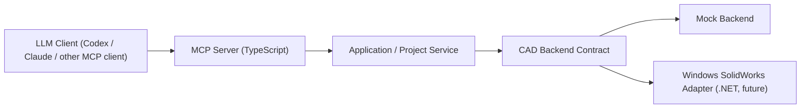

# SYSTEM OVERVIEW

## Layer separation

## Responsibilities

- Client layer: plans and invokes tools, but does not own CAD semantics
- MCP server: protocol, tool registration, resource exposure, and error shaping
- Application layer: orchestrates commands, state, and project metadata
- CAD backend contract: stable abstraction for mock and real execution
- Mock backend: deterministic development and test backend
- Real adapter: Windows-specific automation against SolidWorks 2022 through the .NET worker path

## Why this split matters

- We can build and test now without SolidWorks installed.
- The future COM worker can evolve without polluting the protocol surface.
- State and error behavior can be stabilized before real-machine validation.

## State model

The central model is a normalized part-document state containing:

- selected plane
- active sketch
- sketches and their entities
- dimensions
- solid features
- save/export artifacts

## Current status

- MCP server: implemented
- Mock backend: implemented
- Real adapter: implemented for the current public alpha surface
- Real SolidWorks validation: executed for the current 13-tool public alpha surface on SolidWorks 2022
- Repo-first developer alpha: second-machine validated
- Technical handoff shape: defined and prepared through the alpha handoff companion package

See also:

- `docs/architecture/PUBLIC_ALPHA_BOUNDARY.md`
- `docs/architecture/ALPHA_DELIVERY_MODEL.md`
- `docs/architecture/WINDOWS_BACKEND_BOUNDARY.md`
